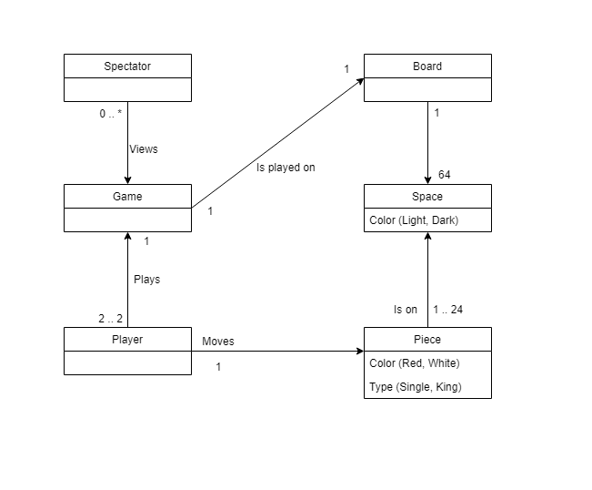

# PROJECT Design Documentation

> _The following template provides the headings for your Design
> Documentation.  As you edit each section make sure you remove these
> commentary 'blockquotes'; the lines that start with a > character
> and appear in the generated PDF in italics._

## Team Information
* Team name: 10d
* Team members
  * rml1168 (Ryan Lei)
  * cxl8351 (Christopher Lee)
  * jwy4877 (Joshua Yadao)
  * ty3226 (Tydarius Young)

## Executive Summary

This is a summary of the project.

### Purpose
The purpose of this project is to make a way for friends and strangers from around the world can play Chess with each other.

### Glossary and Acronyms
> _Provide a table of terms and acronyms._

| Term | Definition |
|------|------------|
| VO | Value Object |

## Requirements

This section describes the features of the application.

The player must sign in before playing any games.

The player must be able to start a game with another player and be able to play it through to completion or resign midway.

The player must be able to signout at any time they please.

The game must follow the standard Chess rules.

### Definition of MVP
The Minimum Viable Product is a WebCheckers Application that allows players to sign-in and find other players to play a match of Checkers. You are allowed to resign if you have to go mid game or you can play it to victory/defeat. You can sign out whenever you please, however your game will not be saved.

### MVP Features
Sign in:

	- Allows you to sign in and play against other players

	- You MUST be signed in to start a match and see other lobbies
Start a game:
	
	- Allows you to click on another player's lobby or have another player click on your lobby and a match will begin.
	
	- This match will be played until either someone resigns, signs out, or there is a victor.

Resign:
	
	- This allows you to resign in the middle of a game, giving the other player a forefeit victory and sending both of you back to the home page.

End game experience:
	
	- This will display a victory or defeat message depending on the circumstance of the end game and a reason (resign, all pieces taken)

### Roadmap of Enhancements
> Spectator mode

> AI Player

## Application Domain

This section describes the application domain.

For our domain model we deicded to have a Game be the central part of our diagram.
Of course, a game is then played on a Board which contains 64 squares (for a standard 8x8 checkers board).
There are then anywhere from 1 to 24 pieces on the board at a time, which can either be single pieces or king pieces.
A player moves each piece around to play the game. There are anywhere from 1 to 2 players controlling the pieces at a time, depending on player resignation.
If we end up doing the spectator enhancement, a spectator will be viewing the Game. Anywhere from 0 to many spectators can be watching.

## Architecture and Design

Our application has 3 tiers of code, them being: UI, Model, and Application.

The Application Tier controls all logic in terms of outside of playing the game itself. This includes managing the players and current games running.

The Model Tier handles all logic in terms of the game itself. There are classes that deal with the board, individual pieces, how pieces move, and in general how the game works.

The UI Tier deals with what the player sees and the routes. This handles getting into games, displaying the home page, signing in and out, and resigning. We also had to include some move validation in this tier because the client has to communicate with the server.

### Summary

The following Tiers/Layers model shows a high-level view of the webapp's architecture.

As a web application, the user interacts with the system using a
browser.  The client-side of the UI is composed of HTML pages with
some minimal CSS for styling the page.  There is also some JavaScript
that has been provided to the team by the architect.

The server-side tiers include the UI Tier that is composed of UI Controllers and Views.
Controllers are built using the Spark framework and View are built using the FreeMarker framework.  The Application and Model tiers are built using plain-old Java objects (POJOs).

Details of the components within these tiers are supplied below.

### Overview of User Interface

This section describes the web interface flow; this is how the user views and interacts
with the WebCheckers application.

The user interface is very user friendly and straight forward. The player will first see the home page when they are not signed in which displays how many users are currently online and will have a sign in button.

The user will then sign in and have to make a username that is not currently taken. Once they are signed in, they are back on the homepage but this time there are player lobbies that they are able to join.

If they try to join an active players lobby, they will be returned to the home screen.

Once they find an avaiable opponent, they are then taken to the game page. There, they can play until either one of the resigns or a player wins. They are then returned to the home screen with all the player lobbies listed.

Of course, during all of this (except for the very beginning when they are not signed in), the user can sign out at any time and get returned to step 1.

### UI Tier
> _Provide a summary of the Server-side UI tier of your architecture.
> Describe the types of components in the tier and describe their
> responsibilities.  This should be a narrative description, i.e. it has
> a flow or "story line" that the reader can follow._

> _At appropriate places as part of this narrative provide one or more
> static models (UML class structure or object diagrams) with some
> details such as critical attributes and methods._

> _You must also provide any dynamic models, such as statechart and
> sequence diagrams, as is relevant to a particular aspect of the design
> that you are describing.  For example, in WebCheckers you might create
> a sequence diagram of the `POST /validateMove` HTTP request processing
> or you might show a statechart diagram if the Game component uses a
> state machine to manage the game._

> _If a dynamic model, such as a statechart describes a feature that is
> not mostly in this tier and cuts across multiple tiers, you can
> consider placing the narrative description of that feature in a
> separate section for describing significant features. Place this after
> you describe the design of the three tiers._

The main hub of our server side UI Tier is the GetHomeRoute class. This is where players are first directed to when they load up WebCheckers and this is where they are sent after sign in and game finishes.

Next we have GetSignInRoute and PostSignInRoute. In order for players to actually play the game, they must sign in and this is how the server handles and displays validation of signing in.

GetGameRoute is our next big class because this is the route players use to get into games. This route handles starting a new match between players, getting the board from the server to the client, and displaying the end game experience.

Row is a class that represents the rows on a Checkers board. These rows contain all the spaces the game has and helps with move validation.

BoardView works with Row to display the game board to the user. This class deals with who is red and who is white, and in turn deals with which side of the board you see on your side.

PostValidateMoveRoute is the route that deals with the client and the server communicating in order to make sure the player is abiding by the rules of checkers. This route will tell the client if they are allowed to make the move they are trying to make.

PostBackupMoveRoute is one of the two routes that go hand in hand with PostValidateMoveRoute because if the client tried to make an invalid move, they use this route to revert to the beginning of their turn to make a valid move.

PostSubmitTurnRoute is the second of the two routes that works with PostValidateMoveRoute. If the move they made is valid, this is the route that is called to send the move through to the server.

PostCheckTurnRoute is a simple route that checks whose turn it is.

Finally, we have PostSignOutRoute, which is simply a route that handles players signing out, which means it has to check if a player is currently mid match and remove them if they are.

### Application Tier
> _Provide a summary of the Application tier of your architecture. This
> section will follow the same instructions that are given for the UI
> Tier above._

The Application Tier contains 2 classes. GameCenter deals with current active games and games that are being created. This class will make a new gameId and store the new game in a HashMap, with the key being the Id and the value being the game instance itself. GameCenter is also the middle man for dealing with turns because it is the class in the Application tier that contains the games themselves.

The PlayerLobby class keeps track of current users online and also deals with validating usernames as players try to sign in. This class contains a HashMap with the key being usernames and the values being user sessions.

### Model Tier

The model tier contains many classes, largely dealing with the functional dynamics of the board and player.

Board: The overall structure simulating an 8x8 matrix of alternating black
and white spaces. Here can be found a majority of movement validation, as well
as the movement of pieces itself. The general rule of thumb is, if it has
an association with the board, the board class will deal with it.

Game: The simulation of two (2) players coming together and playing a 'game'.
This class largely focused on the dynamics of players,
as in a player's basic capabilities (i.e. request to move a piece)
or other general player information (i.e. grab a player's color).

Move: This class dealt with the movement of pieces across our
board. Also dealing with any jump movement. It is worth noting that any movement
validation is not involved within this class. It is simply the movement of piecs.
Piece: This class controlled the status of a piece, or many pieces, on the
board.

Player: This is the class that simulates a person actively playing a game
of checkers (or a person simply within the lobby). Information such
as the player's color or username can be found here.
Position: This class is used in conjunction of movement concept and the board.
It is used to simulate any and all validation.

Space: This class basically places the black and white tiles on the board.

### Design Improvements
> _Discuss design improvements that you would make if the project were
> to continue. These improvement should be based on your direct
> analysis of where there are problems in the code base which could be
> addressed with design changes, and describe those suggested design
> improvements. After completion of the Code metrics exercise, you
> will also discuss the resutling metric measurements.  Indicate the
> hot spots the metrics identified in your code base, and your
> suggested design improvements to address those hot spots._

## Testing

We created test classes for all of the model and application tiers.
While the testing for the application tier saw a great, if not 100%, code coverage,
it was not the same for the other tiers. The model tier posed a completely
different situation in terms of testing because of the coupling of classes
and the overall design of our project. With enough tests though, we were able
to at least meet a somewhat satisfactory standard of code coverage.
Testing for the UI tier was not fully completed. The process of
building the tests seemed much more abstract than the model
tier and application tier. This lead to easy mishaps and many null pointers.

### Acceptance Testing
> _Report on the number of user stories that have passed all their
> acceptance criteria tests, the number that have some acceptance
> criteria tests failing, and the number of user stories that
> have not had any testing yet. Highlight the issues found during
> acceptance testing and if there are any concerns._

### Unit Testing and Code Coverage

The overall code coverage focus was on the model-tier.
Mainly because the majority of functionality can be found within the model.
This includes algorithms such as movement validation, and the passing of
movement information itself. The testing of such tier was very challenging,
and full, 100% testing has yet to be fulfilled due to the shear amount
of conditions required and specifics required. The problem with our current
design, in order to test the code to its fullest, we would have to start
with the board and its already placed pieces. At that point, we would basically
recreate the entire process of gameplay, but by code. Movement of pieces,
jumping pieces, etc. Testing anything further may require a difference in
design in order to relieve stress with the tests.